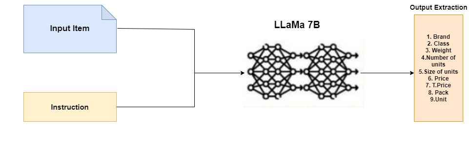

# AMuRD: Annotated Multilingual Receipts Dataset for Cross-lingual Key Information Extraction and Classification 

by
Abdelrahman Abdallah,
Mahmoud Abdalla,
Mohamed Elkasaby,
Yasser Elbendary, 
Adam Jatowt,





## Abstract

> Key information extraction involves recognizing and extracting text from scanned receipts, 
enabling retrieval of essential content, and organizing it into structured documents. 
This paper presents a novel multilingual dataset for receipt extraction, addressing key challenges in information extraction and item classification. 
The dataset comprises $47,720$ samples, including annotations for item names, attributes like (price, brand, etc.), and classification into $44$ product categories. 
We introduce the InstructLLaMA approach, achieving an F1 score of $0.76$ and an accuracy of $0.68$ for key information extraction and item classification.


## Demo for our Instruct LLama


Explore our Instruct LLama system through our live demo:

[**Demo for our Instruct LLama**](http://18.188.209.98:5052/)


To get started with the code and utilize the AMuRD dataset for your research or projects, you can clone this repository:

```bash
git clone https://github.com/yourusername/AMuRD.git
```
## Getting the code


## Dependencies

## Reproducing the results


## Citation 
Please consider to cite our paper:
```
@misc{abdallah2023amurd,
    title={AMuRD: Annotated Multilingual Receipts Dataset for Cross-lingual Key Information Extraction and Classification},
    author={Abdelrahman Abdallah and Mahmoud Abdalla and Mohamed Elkasaby and Yasser Elbendary and Adam Jatowt},
    year={2023},
    eprint={2309.09800},
    archivePrefix={arXiv},
    primaryClass={cs.CL}
}
```

## License


Note: The AMuRD Dataset can only be used for non-commercial research purpose. 
For researchers who wants to use the AMuRD database, please first fill
in this [Application Form](Application_Form/Application_Form_for_AMuRD.doc) 
and send it via email to us ([Yelbendary@discoapp.ai](mailto:Yelbendary@discoapp.ai),[m.abdallah@discoapp.ai](mailto:m.abdallah@discoapp.ai)),([abdoelsayed2016@gmail.com](mailto:abdoelsayed2016@gmail.com)). 


